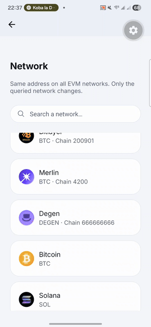
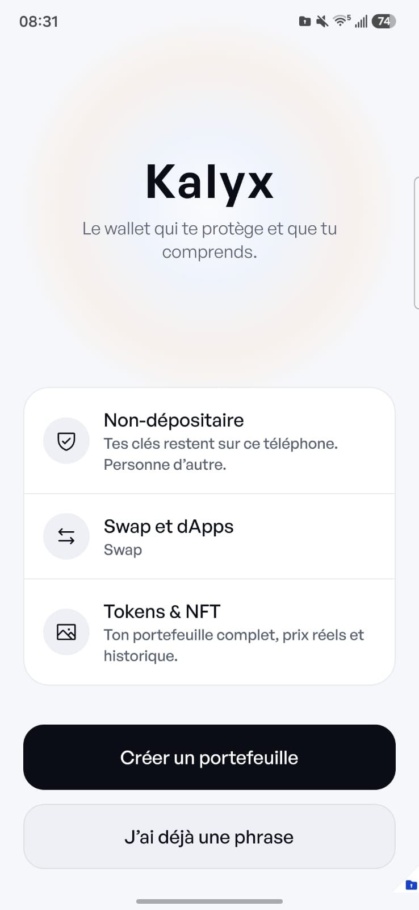
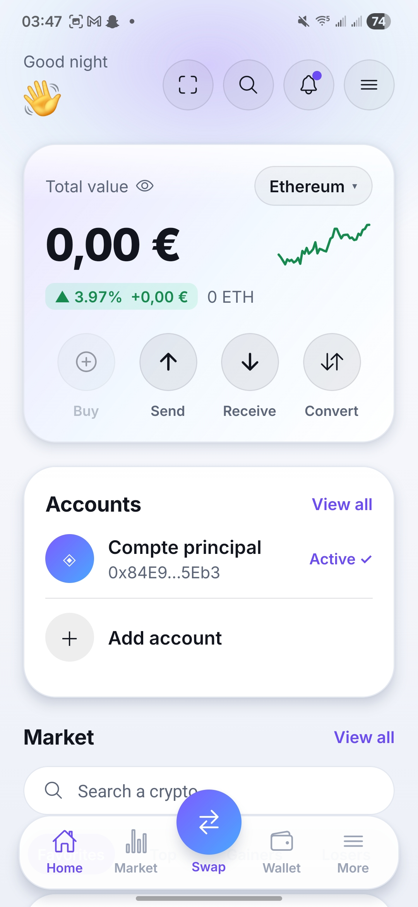
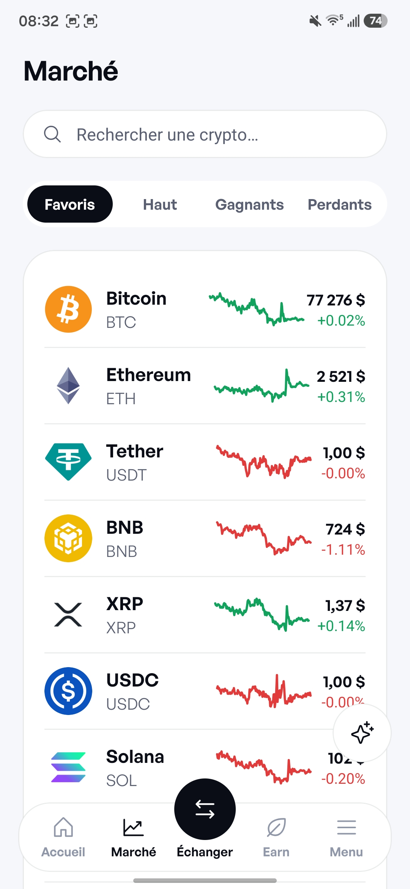
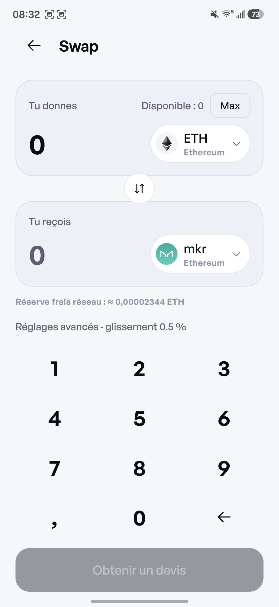
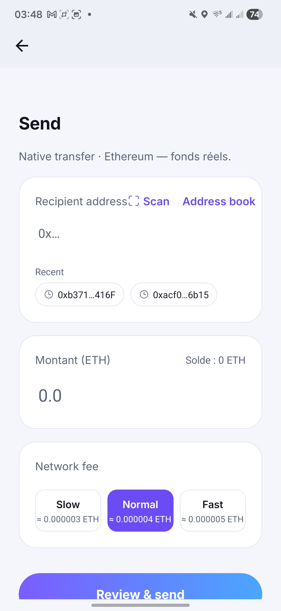
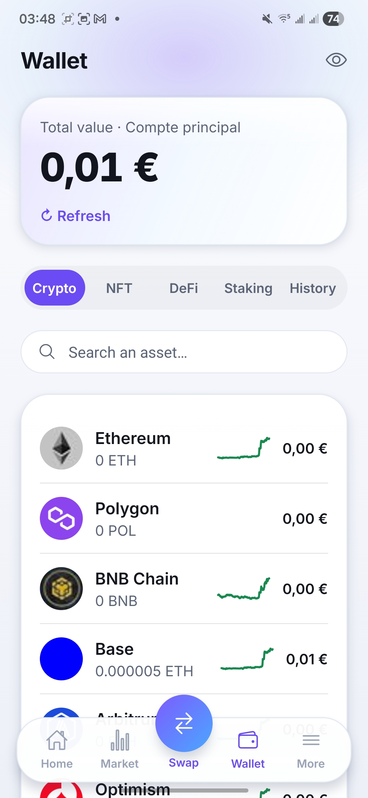
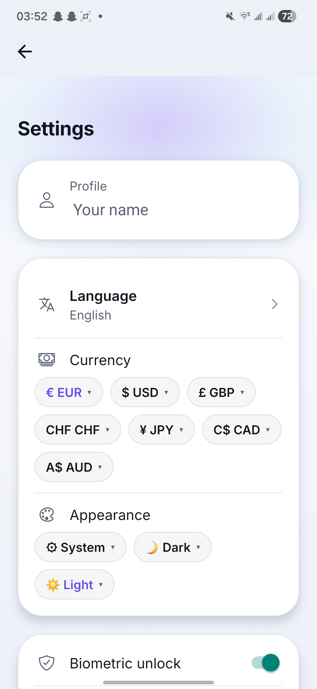
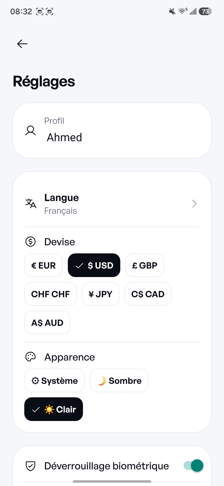

# 🔐 Kalyx Wallet

### Secure. Non-custodial. Multi-chain.

[](https://github.com/ahmedsignate2/kalyx-wallet/actions/workflows/ci.yml)


[](LICENSE)
[](SECURITY.md)

Kalyx Wallet est un **wallet crypto mobile non-custodial** construit avec **React Native, Expo et TypeScript**.

Le projet vise une expérience moderne et accessible tout en gardant une architecture où les secrets du wallet restent sous le contrôle de l'utilisateur.

Kalyx Wallet ne dispose pas d'un **backend propriétaire de conservation** : les wallets et secrets sont gérés localement sur l'appareil. Certaines fonctionnalités utilisent néanmoins des services tiers tels que des RPC, explorers, APIs de marché, WalletConnect ou LI.FI.

> ⚠️ **Statut : développement actif**
>
> Kalyx Wallet n'a pas fait l'objet d'un audit de sécurité indépendant.
> Le projet ne doit pas être considéré comme un produit audité ni comme une solution de conservation de fonds importants.

---


## 🛡️ Sécurité en un coup d'œil

| | |
|---|---|
| **Où sont les clés** | Générées et stockées sur le téléphone uniquement (Keystore/Keychain), chiffrées AES-256-GCM sous une clé dérivée du PIN par scrypt. Jamais sur un serveur, jamais sur le web. |
| **Serveur Kalyx** | Aucun. Pas de compte, pas de session distante, pas de télémétrie. |
| **Signatures** | Chaque signature est expliquée en clair et validée sur le téléphone (PIN/biométrie). Le tableau de bord web ne fait que lire et relayer (WalletConnect). |
| **Avant chaque envoi** | Détection d'empoisonnement d'adresse, simulation de la transaction, analyse GoPlus des contrats. |
| **Audit indépendant** | **Aucun à ce jour.** Projet développé et maintenu par une seule personne. N'y placez pas de montants que vous ne pouvez pas perdre. |
| **Signaler une faille** | Voir [SECURITY.md](SECURITY.md) — Telegram [@kalyxntw](https://t.me/kalyxntw) · support@kalyxwallet.com. Jamais via les Issues publiques. |
| **Licence** | Propriétaire, code source consultable ([LICENSE](LICENSE)). Acquisition / licence commerciale possibles. |

## 💸 Frais — transparence

| Opération | Frais Kalyx | Détail |
|---|---|---|
| Envoyer / recevoir | **0 %** | Uniquement les frais du réseau. |
| Swap et bridge EVM (LI.FI) | **0,3 %** | Appliqués **seulement** si `EXPO_PUBLIC_FEE_RECIPIENT_EVM` est configuré au build. Si LI.FI refuse la commission, repli automatique sur une route **sans** commission. |
| Swap Solana (Jupiter) | **0,3 %** | Appliqués seulement si `EXPO_PUBLIC_FEE_RECIPIENT_SOLANA` est configuré et que SOL/wSOL est d'un côté de l'échange. |
| Earn / staking | **0 %** | Aucune commission Kalyx. |

Aucune adresse de perception n'est codée en dur : elle vient des variables d'environnement au moment du build (`.env.example`). Le récapitulatif de swap affiche toujours le pourcentage **réellement** inclus dans le devis (`kalyxFeeApplied`), jamais une constante.

## ⚠️ Limites connues

- Pas d'audit de sécurité indépendant (voir ci-dessus).
- Android uniquement (APK signé) ; iOS et extension navigateur à venir.
- Tableau de bord web : pas de swap au départ de Bitcoin (EVM et Solana seulement) ; le suivi de confirmation Bitcoin n'est pas affiché en direct.
- Certaines fonctions dépendent de services tiers gratuits (RPC publics, CoinGecko, GoPlus) qui peuvent être indisponibles ou limités.
- Intégration hardware wallet (Ledger) non finalisée.

## 📲 Télécharger l'APK
[](https://github.com/ahmedsignate2/kalyx-wallet-release/releases/latest)

Chaque release publie l'APK **et** son empreinte `kalyx-wallet.apk.sha256`. Vérifiez le fichier téléchargé avant de l'installer :

```bash
sha256sum -c kalyx-wallet.apk.sha256
```

Les APK sont publiés sur le dépôt de distribution **[kalyx-wallet-release](https://github.com/ahmedsignate2/kalyx-wallet-release)** (empreinte SHA-256 et certificat de signature documentés dans son README). Le lien neutre [kalyxwallet.com/download](https://kalyxwallet.com/download) redirige toujours vers la dernière version. Tableau de bord web (lecture seule + signatures relayées au téléphone) : [app.kalyxwallet.com](https://app.kalyxwallet.com).


## 🎬 Démo

<div align="center">
  
</div>

## 📱 Screenshots

| Bienvenue | Accueil | Marché | Swap |
| :---: | :---: | :---: | :---: |
|  |  |  |  |

| Envoi | Wallet | Navigateur | Paramètres |
| :---: | :---: | :---: | :---: |
|  |  |  |  |

## 💼 Acquisition

Kalyx Wallet est actuellement proposé à l'acquisition.

Le repository comprend notamment le code source original de Kalyx Wallet, le moteur applicatif et crypto, l'application mobile, les intégrations développées pour le projet, la documentation technique et le travail de développement existant, sous réserve des licences et droits applicables aux composants tiers.

Pour une acquisition, une licence commerciale, un partenariat ou une demande professionnelle : via nos canaux officiels **Telegram [@kalyxntw](https://t.me/kalyxntw)** ou **X [@kalyxntw](https://x.com/kalyxntw)**

---

## ✨ Fonctionnalités

### 💼 Wallet

- Création de wallet avec **BIP-39**
- Phrases de récupération de 12 ou 24 mots
- Import par phrase de récupération
- Import de wallet EVM par clé privée
- Multi-wallet
- Multi-comptes dérivés
- PIN et protection anti-brute-force
- Verrouillage automatique
- Authentification biométrique pour les opérations sensibles
- Révélation protégée de la phrase de récupération
- Changement de PIN
- Réinitialisation du wallet
- Sauvegarde chiffrée côté client

### 🔗 Multi-chain

Kalyx utilise une architecture basée sur des **Chain Adapters** permettant de partager le moteur EVM entre de nombreux réseaux.

Le catalogue actuel comprend un large ensemble de réseaux, incluant des réseaux EVM, Bitcoin, Solana et des testnets.

Réseaux notamment pris en charge :

- Ethereum
- BNB Chain
- Polygon
- Base
- Arbitrum
- Optimism
- Avalanche
- Linea
- Scroll
- zkSync Era
- Gnosis
- Mantle
- Celo
- Berachain
- Sonic
- Cronos
- Moonbeam
- Metis
- Polygon zkEVM
- Mode
- Manta
- opBNB
- Taiko
- Unichain
- World Chain
- Sei
- Flare
- Kava
- Aurora
- Fantom
- Fraxtal
- Ink
- Soneium
- Abstract
- Zora
- Lisk
- Boba
- BOB
- Immutable
- Astar
- Fuse
- Kaia
- Gravity
- Rootstock
- Ronin
- ApeChain
- Core
- ZetaChain
- Etherlink
- Story
- Zircuit
- Plume
- Morph
- Swell
- Superseed
- Hemi
- Bitlayer
- Merlin
- Degen
- Monad Testnet
- Bitcoin
- Solana

Les testnets sont séparés du catalogue mainnet et masqués par défaut.

### ₿ Bitcoin

- Dérivation HD
- BIP-84
- SegWit natif
- Validation d'adresses
- Solde
- Historique
- Sélection d'UTXO
- Construction de transactions
- Signature
- Diffusion des transactions

### ◎ Solana

- Dérivation SLIP-0010 / Ed25519
- Dérivation compatible avec les wallets Solana courants
- Solde SOL
- Historique
- Tokens SPL
- Associated Token Accounts
- `TransferChecked`
- Envoi de SOL
- Envoi de tokens SPL

---

## 💸 Transactions

Selon le réseau, Kalyx prend en charge :

- Envoi
- Réception
- QR codes
- Deep links
- Validation des adresses
- Validation stricte des montants
- Estimation des frais
- Historique
- Liens vers les explorers
- Gestion des erreurs

Les montants financiers sont manipulés avec des représentations précises, notamment `bigint`, afin d'éviter les pertes liées aux nombres flottants.

---

# 🛡️ Sécurité

La sécurité est intégrée à l'architecture du projet.

## 🔑 Gestion des secrets

La seed ou la clé privée :

1. est générée ou importée localement ;
2. est protégée dans le coffre chiffré ;
3. est déchiffrée uniquement lorsque nécessaire ;
4. est utilisée pour l'opération cryptographique ;
5. est conservée uniquement pendant la durée nécessaire à l'opération.

Le projet ne promet pas un effacement mémoire cryptographique garanti après utilisation. JavaScript et son garbage collector ne permettent pas de garantir un effacement déterministe de la mémoire.

Les secrets ne sont pas destinés à être envoyés sur le réseau ni écrits dans les logs.

## 🔐 Stockage local

Kalyx utilise `expo-secure-store` pour le stockage sécurisé local.

Le coffre protégé par PIN est séparé du mécanisme biométrique. Lorsque l'authentification biométrique est activée, Kalyx effectue une authentification biométrique explicite avant d'accéder au secret biométrique stocké. La biométrie ne signifie donc pas que toute la seed est directement protégée par Face ID ou Touch ID.

## 👆 Opérations sensibles

Le déverrouillage peut être requis avant notamment :

- Envoi
- Swap
- Signature WalletConnect
- Connexion/signature dApps
- Approbations
- Révélation de la phrase de récupération

## 🚨 Analyse de risques

Kalyx contient plusieurs mécanismes de protection :

- checksum EIP-55
- validation des adresses
- validation des montants
- décodage local de transactions
- détection de transactions à risque
- analyse GoPlus
- détection de sites de phishing
- analyse des demandes WalletConnect
- analyse SIWE
- résumé des données EIP-712
- détection jailbreak/root

Ces mécanismes réduisent certains risques mais ne constituent pas une garantie de sécurité absolue.

---

# 🔗 WalletConnect & dApps

Kalyx intègre WalletConnect pour les connexions et signatures avec des dApps.

Les demandes peuvent être présentées avec notamment :

- nom du site / dApp
- domaine
- adresse
- réseau
- action demandée
- informations de transaction
- données EIP-712
- messages SIWE

Le moteur contient également une vérification des incohérences de domaine SIWE afin de signaler certains scénarios potentiels de phishing.

---

# 🔄 Swap & Bridge

Kalyx utilise **LI.FI** pour les opérations de swap et de bridge EVM.

La configuration actuelle contient :

- intégrateur LI.FI : `nova-wallet` (identifiant historique enregistré sur portal.li.fi)
- commission Kalyx : **0,3 %**, appliquée uniquement si `EXPO_PUBLIC_FEE_RECIPIENT_EVM` est défini au build
- slippage par défaut : **0,5 %**
- Solana : Jupiter, même commission de 0,3 % via `EXPO_PUBLIC_FEE_RECIPIENT_SOLANA` (SOL/wSOL d'un côté de l'échange)

Si LI.FI refuse une quote avec la commission configurée, le code bascule automatiquement sur une quote **sans** commission. Le récapitulatif affiche le pourcentage réellement inclus dans le devis retenu (`kalyxFeeApplied`). Voir la section « Frais — transparence » en tête de README.

---

# 🪙 Tokens, NFT & DeFi

### ERC-20

- Récupération des tokens
- Métadonnées
- Tokens personnalisés
- Détection de tokens spam
- Transferts ERC-20

### SPL

- Tokens Solana
- Métadonnées
- Associated Token Accounts
- Transferts SPL

### NFT

- Récupération des NFT
- Métadonnées
- Galerie
- Contrat
- Token ID
- Lien vers l'explorer

### DeFi

Le moteur contient une couche de classification permettant d'identifier différentes catégories de tokens et positions DeFi.

### Approbations

Kalyx contient également des outils pour analyser et révoquer des approbations ERC-20.

---

# 📈 Marché & portefeuille

Kalyx intègre des données de marché et de portefeuille pour :

- prix crypto
- variations 24h
- graphiques historiques
- recherche de coins
- données de tokens
- valeur totale du portefeuille
- répartition des actifs
- favoris
- historique des transactions
- export CSV

Les intégrations de données incluent notamment CoinGecko, Alchemy et différents explorers/RPC selon le réseau.

---

# 💾 Sauvegarde chiffrée

Kalyx propose une sauvegarde chiffrée côté client.

```text
Seed
  ↓
Mot de passe utilisateur
  ↓
KDF
  ↓
AES-256-GCM
  ↓
Backup JSON versionné
  ↓
Partage via le système natif
```

La seed est chiffrée avant le partage.

Aucune seed n'est envoyée à un backend Kalyx.

La sauvegarde peut ensuite être partagée via les mécanismes natifs disponibles sur l'appareil.

⚠️ Le mot de passe de sauvegarde est indispensable pour restaurer le backup. Il doit être conservé séparément.

---

# 🔌 Hardware Wallet

Le projet prépare l'intégration de hardware wallets, notamment Ledger via Bluetooth.

Les dépendances et éléments de configuration nécessaires sont présents dans le projet.

Cependant, l'intégration hardware wallet complète n'est pas considérée comme finalisée dans l'état actuel du repository.

---

# 📷 QR Codes & Deep Links

Kalyx possède un moteur de parsing permettant d'identifier notamment :

- adresses crypto
- URIs de paiement
- liens WalletConnect
- URLs
- liens Ethereum

L'application configure également les deep links nécessaires aux usages WalletConnect et Ethereum.

---

# 🎨 Interface

L'application utilise notamment :

- React Native
- Expo
- Expo Router
- TypeScript
- Zustand
- Expo Secure Store
- Expo Local Authentication
- Expo Camera
- Expo Clipboard
- Expo Notifications
- React Native WebView
- React Native SVG
- QR Code
- Inter / Outfit

L'interface comprend notamment :

- thème sombre
- thème clair
- thème système
- mode Débutant / Expert
- multi-langue
- devises fiat
- animations
- skeleton loading
- graphiques interactifs
- toasts
- navigation mobile
- Error Boundary

---

# 🏗️ Architecture

```
┌──────────────────────────────────────────┐
│              📱 APP / UI                   │
│                                            │
│  Expo Router                              │
│  React Native                             │
│  Screens / Components / UX                │
└───────────────────┬──────────────────────┘
                     │
┌───────────────────▼──────────────────────┐
│           🧠 APPLICATION                   │
│                                            │
│  Zustand Stores                           │
│  Wallet Store                             │
│  Settings                                 │
│  WalletConnect                            │
│  Contacts                                 │
│  Secure Storage                           │
└───────────────────┬──────────────────────┘
                     │
┌───────────────────▼──────────────────────┐
│           🔐 CORE ENGINE                   │
│                                            │
│  BIP-39 / BIP-32 / BIP-44 / BIP-84        │
│  EVM / Bitcoin / Solana                   │
│  Chain Adapters                           │
│  Validation                               │
│  Transactions                             │
│  Security                                 │
│  Prices / Tokens / NFT                    │
│  Swap / Bridge                            │
│  WalletConnect                            │
└──────────────────────────────────────────┘
```

`src/` constitue le moteur TypeScript du projet.

L'application mobile utilise ce moteur via `src/index.ts`.

Cette séparation permet notamment d'isoler :

- cryptographie
- dérivation
- validation
- chaînes
- transactions
- sécurité
- données blockchain
- swap
- WalletConnect

---

# 🧩 Chain Adapter

Les chaînes sont branchées sur une interface commune.

```ts
interface ChainAdapter {
  deriveAccount(seed: Uint8Array, index: number): Account;
  getBalance(address: string): Promise<Balance>;
  buildTransaction(params: TxParams): Promise<UnsignedTx>;
  signTransaction(
    tx: UnsignedTx,
    privateKey: Uint8Array
  ): Promise<SignedTx>;
  broadcast(signedTx: SignedTx): Promise<TxHash>;
}
```

Pour les réseaux EVM, un même adapter peut être paramétré avec différentes configurations de réseau.

---

# 🔑 Dérivation

**EVM**

```
m/44'/60'/0'/0/0
```

Les réseaux EVM compatibles utilisent le coin type 60.

**Bitcoin**

```
m/84'/0'/0'/0/0
```

**Solana**

```
m/44'/501'/0'/0'
```

Solana utilise Ed25519 et une dérivation distincte des réseaux EVM.

---

# 📁 Structure du projet

```
kalyx-wallet/
│
├── app/                # Écrans Expo Router
├── src/                # 🧠 Moteur crypto / blockchain
│   ├── crypto/
│   ├── domain/
│   │   ├── chains/
│   │   ├── wallet/
│   │   ├── tokens/
│   │   ├── prices/
│   │   ├── nft/
│   │   ├── swap/
│   │   ├── wc/
│   │   ├── qr/
│   │   ├── ens/
│   │   ├── approvals/
│   │   ├── defi/
│   │   └── security/
│   └── security/
│
├── lib/                # Logique applicative
├── ui/                 # Design system / composants
├── __tests__/          # Tests
├── docs/               # Documentation
├── assets/             # Assets application
│
├── app.config.ts
├── package.json
├── tsconfig.json
├── jest.config.js
│
├── SECURITY.md
├── PRIVACY.md
├── TERMS.md
├── CONTRIBUTING.md
├── ANDROID_GUIDE.md
├── MOBILE_SETUP.md
└── HANDOFF.md
```

---

# 🛠️ Stack technique

| Domaine | Technologie |
|---|---|
| Mobile | React Native |
| Framework | Expo |
| Navigation | Expo Router |
| Langage | TypeScript |
| State | Zustand |
| EVM | ethers v6 |
| Bitcoin | @scure/btc-signer |
| Mnemonic | @scure/bip39 |
| HD Wallet | @scure/bip32 |
| Crypto | @noble/* |
| Secure storage | expo-secure-store |
| Biométrie | expo-local-authentication |
| QR | expo-camera / react-native-qrcode-svg |
| WalletConnect | WalletConnect v2 |
| Market data | CoinGecko |
| Blockchain data | Alchemy / explorers / RPC |
| Security analysis | GoPlus |
| Swap / Bridge | LI.FI |
| Hardware wallet | Ledger BLE dependencies |
| Tests | Jest |
| CI | GitHub Actions |

---

# 🚀 Installation

### Prérequis

- Node.js 20 recommandé
- npm
- Android Studio pour Android
- Xcode sur macOS pour iOS
- environnement Expo compatible
- appareil physique recommandé pour les fonctionnalités natives

### Cloner

```bash
git clone https://github.com/ahmedsignate2/kalyx-wallet.git
cd kalyx-wallet
npm install
```

### Variables d'environnement

Le repository fournit un `.env.example`.

Exemple :

```
EXPO_PUBLIC_ALCHEMY_KEY=
EXPO_PUBLIC_ETHERSCAN_KEY=
EXPO_PUBLIC_LIFI_KEY=
EXPO_PUBLIC_ENV=development
```

⚠️ Ne placez jamais une seed, une clé privée, un PIN, un mot de passe ou un secret utilisateur dans le code ou dans une variable publique Expo.

### ▶️ Développement

```bash
npm start
```

**Android**

```bash
npm run android
```

**iOS**

```bash
npm run ios
```

**Web**

```bash
npm run web
```

**Export Web**

```bash
npm run build:web
```

---

# 🧪 Tests & CI

Les scripts principaux sont :

```bash
npm test
npm run typecheck
```

Pour la CI :

```bash
npm test -- --ci --runInBand
```

GitHub Actions ([workflow CI](.github/workflows/ci.yml), badge en tête de README) exécute le typecheck TypeScript strict et les tests Jest à chaque push et pull request sur `main` et `develop`.

Le workflow contient également un garde-fou recherchant certains patterns de logs susceptibles de contenir des seeds, clés privées ou autres secrets dans `src/`.

Le nombre exact de tests n'est volontairement pas figé dans ce README afin d'éviter que la documentation devienne obsolète.

---

# 🗺️ État du projet

### ✅ Présent dans le repository

- [x] Wallet EVM
- [x] Bitcoin
- [x] Solana
- [x] Multi-wallet
- [x] Multi-comptes
- [x] BIP-39 / HD derivation
- [x] PIN
- [x] Authentification biométrique
- [x] Secure storage
- [x] Envoi / réception
- [x] Historique
- [x] Tokens ERC-20
- [x] Tokens SPL
- [x] NFT
- [x] WalletConnect
- [x] SIWE / EIP-712 parsing
- [x] Swap / Bridge LI.FI
- [x] ENS
- [x] Analyse de risques GoPlus
- [x] Approbations ERC-20
- [x] Sauvegarde chiffrée
- [x] QR / deep links
- [x] Données de marché
- [x] Export CSV
- [x] Réseaux personnalisés
- [x] Testnets séparés

### 🚧 À finaliser / renforcer

- [ ] Validation complète des fonctionnalités natives sur appareils physiques
- [ ] Validation du thème clair sur tous les écrans
- [ ] Validation avec petits montants réels avant utilisation sérieuse
- [ ] Intégration hardware wallet complète
- [ ] Durcissement supplémentaire avant distribution publique
- [ ] Audit de sécurité indépendant
- [ ] Finalisation des builds et assets de store

---

# 📚 Documentation

- ANDROID_GUIDE.md
- MOBILE_SETUP.md
- SECURITY.md
- PRIVACY.md
- TERMS.md
- CONTRIBUTING.md
- HANDOFF.md

---

# 🤝 Contribution

Les suggestions, rapports de bugs, demandes de fonctionnalités et améliorations sont les bienvenus.

- 💡 Suggestions : GitHub Discussions
- 🐛 Bugs : GitHub Issues
- 🔐 Vulnérabilités : SECURITY.md
- 💬 Contact officiel : Telegram [@kalyxntw](https://t.me/kalyxntw) · X [@kalyxntw](https://x.com/kalyxntw)

Avant de proposer une modification :

1. Comprendre la séparation `src/` / `app/` / `lib/` / `ui/`.
2. Lire la documentation de sécurité.
3. Ajouter les tests nécessaires.
4. Vérifier le typecheck.
5. Ne jamais logger de secret.
6. Tester les fonctionnalités natives sur appareil lorsque nécessaire.

```bash
npm run typecheck
npm test
```

---

# 🔒 Responsible Disclosure

Les vulnérabilités de sécurité ne doivent pas être publiées dans les GitHub Issues.

Contact sécurité :

**Telegram [@kalyxntw](https://t.me/kalyxntw) · X [@kalyxntw](https://x.com/kalyxntw)**

Ne transmettez jamais dans un rapport :

- phrase de récupération
- clé privée
- PIN
- mot de passe
- token d'authentification
- secret API

Voir SECURITY.md.

---

# 💙 Support the Project

Si vous souhaitez soutenir le développement de Kalyx Wallet :

**BTC**
```
bc1qwdqesyfzja4585f09ylvp4rc2lyqhvmvlvytx4
```

Les contributions peuvent aider à financer :

- développement
- tests
- infrastructure
- documentation
- sécurité
- audits futurs

---

# ⚠️ Security Warning

Kalyx Wallet ne vous demandera jamais :

- votre phrase de récupération
- votre clé privée
- votre PIN
- votre mot de passe
- votre code d'authentification

---

# ⚠️ Avertissement

Kalyx Wallet manipule des actifs numériques et des secrets cryptographiques.

Le projet est en développement actif et n'a pas fait l'objet d'un audit de sécurité indépendant.

N'utilisez pas Kalyx Wallet avec des montants que vous ne pouvez pas vous permettre de perdre.

Les RPC, explorers, APIs de marché, WalletConnect, LI.FI et autres services tiers peuvent avoir leurs propres limitations, indisponibilités ou risques.

---

# 📄 Licence

Kalyx Wallet est sous **licence propriétaire, code source consultable** ([LICENSE](LICENSE)) :

- lecture, clonage, build local et recherche en sécurité : **autorisés** ;
- usage commercial, redistribution, revente, forks publics, réutilisation de la marque : **interdits** sans accord écrit ;
- **acquisition** du projet ou **licence commerciale** (simple ou exclusive) : possibles, conditions définies par contrat — Telegram [@kalyxntw](https://t.me/kalyxntw), X [@kalyxntw](https://x.com/kalyxntw), support@kalyxwallet.com.

Les bibliothèques tierces restent soumises à leurs propres licences.

---

# 👤 À propos du développeur

Kalyx Wallet est conçu, développé et maintenu par **un développeur indépendant** (KALYX, entreprise individuelle, France). Pas d'équipe, pas de levée de fonds, pas de serveur : le projet vit de ses utilisateurs et du soin apporté au code.

Ouvert à une **acquisition**, un **partenariat** ou une **licence commerciale** — voir la section Licence.

---

# 🦁 Kalyx Wallet

**Your keys. Your wallet. Your control.**

Built with TypeScript, React Native, Expo and an unreasonable amount of security paranoia.
