# 🔐 Kalyx Wallet

### Secure. Non-custodial. Multi-chain.

[](https://github.com/ahmedsignate2/kalyx-wallet/actions/workflows/ci.yml)


[](LICENSE)
[](SECURITY.md)

Kalyx Wallet est un **wallet crypto non-custodial** pour Android, accompagné d'un **tableau de bord web**, d'une **mini-app Telegram** et d'un **bot Telegram**. Il est construit avec **React Native, Expo et TypeScript**.

Les clés sont générées et gardées **sur le téléphone, et nulle part ailleurs**. Kalyx n'a aucun serveur de conservation, aucun compte, aucune télémétrie. Le web et Telegram ne signent jamais : chaque opération est validée sur le téléphone.

> 🚀 **Bêta ouverte.** L'app est utilisable et gratuite, et vos retours façonnent la suite :
> Telegram [@kalyxntw](https://t.me/kalyxntw) · X [@kalyxntw](https://x.com/kalyxntw) · support@kalyxwallet.com
>
> ⚠️ Kalyx n'a pas fait l'objet d'un **audit de sécurité indépendant** et est développé par une seule personne. N'y placez pas de montants que vous ne pouvez pas perdre.

| | |
|---|---|
| 📲 **Télécharger (Android)** | [kalyxwallet.com/download](https://kalyxwallet.com/download) — APK + empreinte SHA-256 sur [kalyx-wallet-release](https://github.com/ahmedsignate2/kalyx-wallet-release/releases/latest) |
| 🖥️ **Tableau de bord web** | [app.kalyxwallet.com](https://app.kalyxwallet.com) — relié au téléphone par WalletConnect |
| ✈️ **Telegram** | Mini-app (même tableau de bord) + bot : cours, gas, analyse de token, alertes de prix |
| 🌐 **Site** | [kalyxwallet.com](https://kalyxwallet.com) — FAQ, confidentialité, conditions, mentions légales |

---

## 📱 Aperçu

| Accueil | Marché | Swap | Gagner |
| :---: | :---: | :---: | :---: |
| 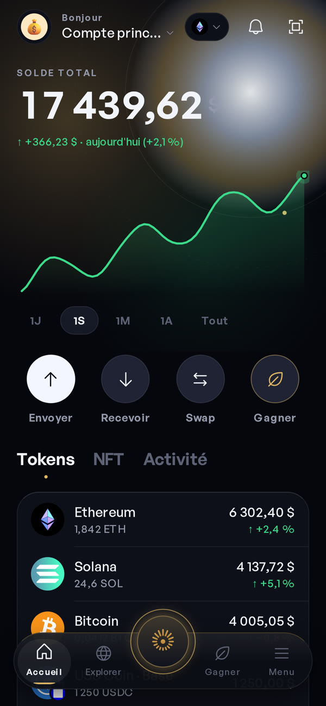 | 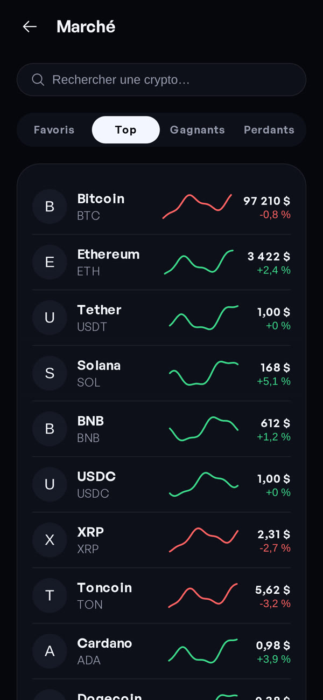 | 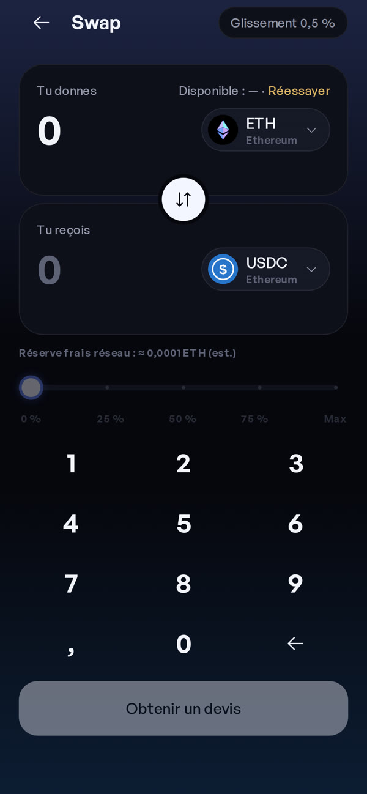 | 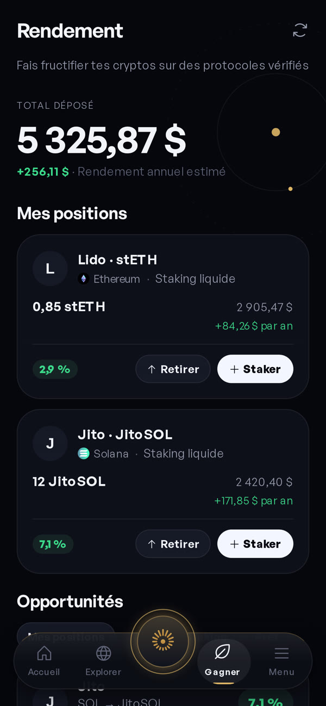 |

| Sécurité | Code de contrainte | Liste blanche | Autorisations |
| :---: | :---: | :---: | :---: |
| 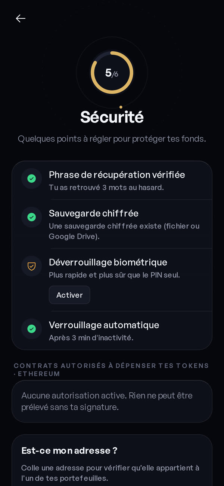 | 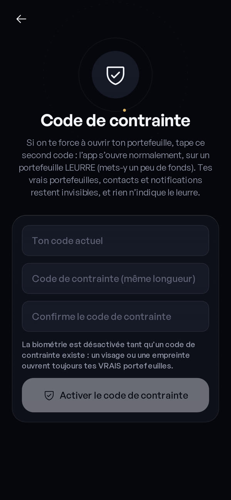 | 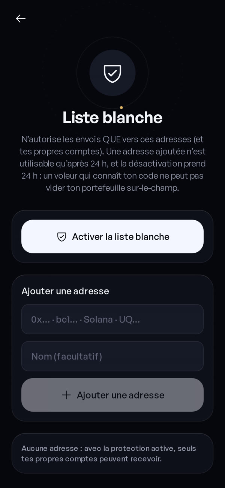 | 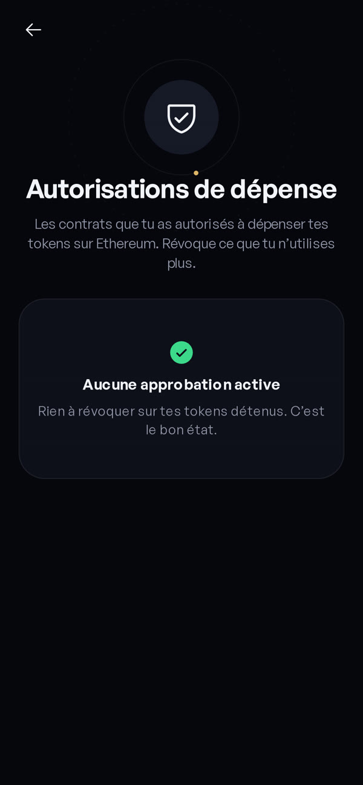 |

| Bienvenue | Envoyer | Explorer | Réglages |
| :---: | :---: | :---: | :---: |
| 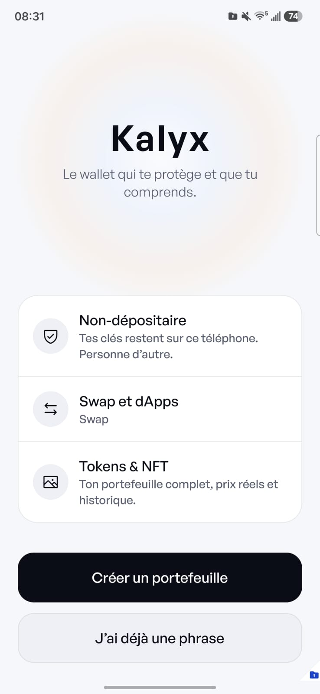 | 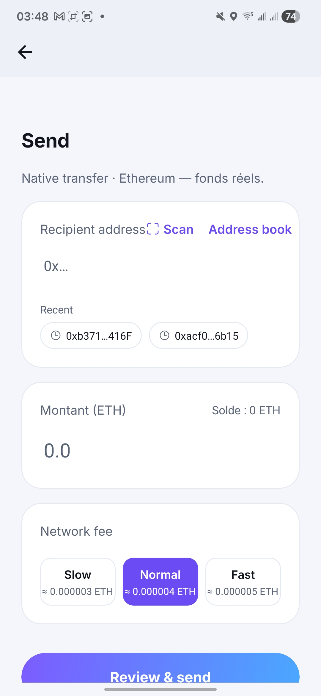 | 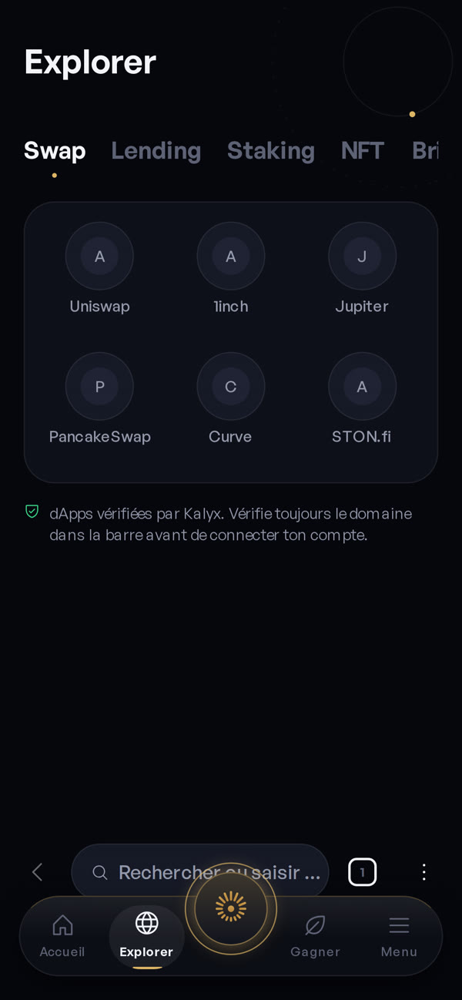 | 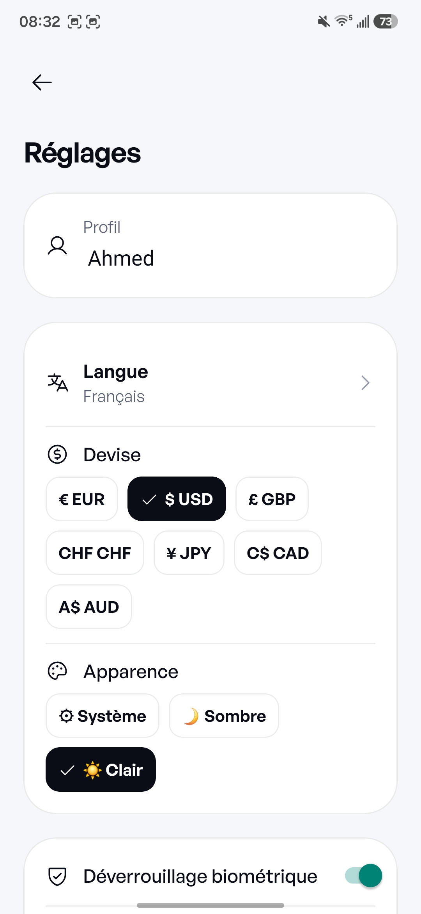 |

**Tableau de bord web** (ordinateur, navigateur mobile, Telegram) :

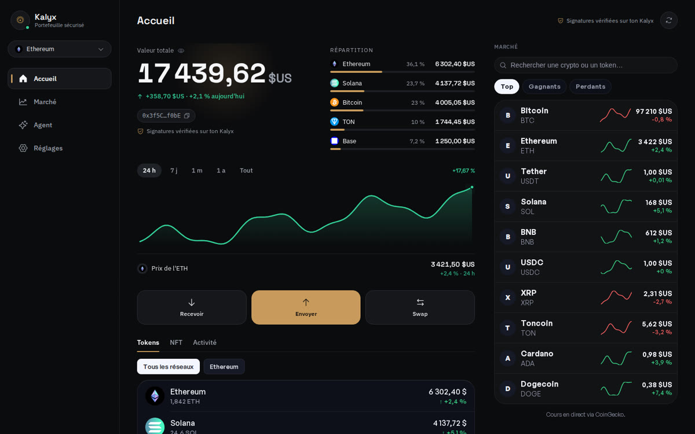

---

## 🛡️ Sécurité en un coup d'œil

| | |
|---|---|
| **Où sont les clés** | Générées et stockées sur le téléphone uniquement (Keystore/Keychain), chiffrées AES-256-GCM sous une clé dérivée du PIN par scrypt. Jamais sur un serveur, jamais sur le web. |
| **Serveur Kalyx** | Aucun pour le wallet : pas de compte, pas de session distante, pas de télémétrie. (Le bot Telegram ne garde que l'identifiant Telegram, la langue et les alertes de prix.) |
| **Signatures** | Chaque demande est expliquée en clair (« Tu vas envoyer 0,25 ETH à … ») et validée sur le téléphone par PIN/biométrie. Le web et Telegram ne font que lire et relayer (WalletConnect). |
| **Avant chaque envoi** | Anti-Drainer (simulation de la transaction), détection d'empoisonnement d'adresse, première fois vers cette adresse, analyse GoPlus des contrats, « maintenir pour envoyer ». |
| **Sous la contrainte** | Un **code de contrainte** ouvre un **portefeuille leurre** : les vrais portefeuilles, contacts et historiques restent invisibles. |
| **Liste blanche** | Envois limités aux adresses approuvées ; un ajout ou une désactivation ne prend effet qu'après **24 h**. |
| **Audit indépendant** | **Aucun à ce jour.** |
| **Signaler une faille** | [SECURITY.md](SECURITY.md) — Telegram [@kalyxntw](https://t.me/kalyxntw) · support@kalyxwallet.com. Jamais via les Issues publiques. |

## 💸 Frais — transparence

| Opération | Frais Kalyx | Détail |
|---|---|---|
| Envoyer / recevoir | **0 %** | Uniquement les frais du réseau. |
| Swap et bridge EVM (LI.FI) | **0,3 %** | Seulement si `EXPO_PUBLIC_FEE_RECIPIENT_EVM` est configuré au build. Si LI.FI refuse la commission, repli automatique sur une route **sans** commission. |
| Swap Solana (Jupiter) | **0,3 %** | Seulement si `EXPO_PUBLIC_FEE_RECIPIENT_SOLANA` est configuré et que SOL/wSOL est d'un côté de l'échange. |
| Gagner (staking, prêt) | **0 %** | Aucune commission Kalyx. |

Aucune adresse de perception n'est codée en dur. Le récapitulatif de swap affiche toujours le pourcentage **réellement** inclus dans le devis (`kalyxFeeApplied`).

## ⚠️ Limites connues

- Pas d'audit de sécurité indépendant.
- Android uniquement (APK signé, hors Play Store pour l'instant) ; pas encore d'app iOS ni d'extension navigateur.
- Tableau de bord web : TON n'y est pas signable (WalletConnect ne couvre pas TON) ; pas encore d'onglet Gagner ni de révocation d'autorisations côté web.
- Pas de mise à jour à distance : chaque correctif passe par un nouvel APK.
- Plusieurs fonctions dépendent de services tiers (RPC, CoinGecko, GoPlus, LI.FI…) qui peuvent être lents, limités ou indisponibles.
- Pas de wallet matériel (Ledger, Trezor…) pour l'instant.

---

## ✨ Fonctionnalités

### 💼 Portefeuilles et comptes
- Création **BIP-39** (12 ou 24 mots), vérification de la phrase, import par phrase.
- Import par **clé privée** : EVM (hex), Bitcoin (WIF), Solana (base58 / hex / JSON).
- **Recherche des comptes** à l'import (comptes dérivés déjà utilisés).
- **Multi-portefeuilles**, multi-comptes dérivés, **portefeuilles en lecture seule** (adresse suivie, sans clé).
- PIN avec anti-brute-force (horloge murale + monotone), biométrie, verrouillage automatique.
- Sauvegarde **chiffrée** (fichier, mot de passe distinct du PIN, scrypt + AES-256-GCM) et sauvegarde **Google Drive** de tous les portefeuilles.

### 🔗 65 réseaux
**62 réseaux EVM + Bitcoin + Solana + TON**, derrière une même interface d'adaptateur :

Ethereum, BNB Chain, Polygon, Base, Arbitrum, Optimism, Avalanche, Linea, Scroll, Blast, zkSync Era, Gnosis, Mantle, Celo, Berachain, Hyperliquid, Sonic, Cronos, Moonbeam, Metis, Polygon zkEVM, Mode, Manta Pacific, opBNB, Taiko, Unichain, World Chain, Sei, Flare, Kava, Aurora, Fantom, Fraxtal, Ink, Soneium, Abstract, Zora, Lisk, Boba Network, BOB, Immutable zkEVM, Astar, Fuse, Kaia, Gravity, Rootstock, Ronin, ApeChain, Core, ZetaChain, Etherlink, Story, Zircuit, Plume, Morph, Swellchain, Superseed, Hemi, Bitlayer, Merlin, Degen, MemeCore, **Bitcoin**, **Solana**, **TON**.

**Réseaux de test** (masqués par défaut, jamais comptés dans le total) : Sepolia, Base Sepolia, Monad Testnet, Solana Devnet, TON Testnet. Une fois affichés, leurs soldes apparaissent dans une section à part de l'accueil, et ils sont utilisables depuis le tableau de bord web. Plus des **réseaux EVM personnalisés** (Chain ID vérifié auprès du RPC).

### 💸 Envoyer et recevoir
- Envoi en 4 étapes : actif → destinataire (contacts, récents, ENS, scan QR) → montant (clavier, bascule devise/jeton, Max moins les frais) → récapitulatif **maintenir pour envoyer**.
- Contrôles : adresse empoisonnée (bloquant), première fois vers cette adresse, contrat destinataire, loyer Solana, réserve de gas, simulation Anti-Drainer.
- Suivi Envoyée → Incluse → Confirmée ; accélération Bitcoin (RBF).
- Recevoir : QR, partage, URI de paiement **EIP-681**, **BIP-21**, **Solana Pay**, **TON Pay** ; WalletConnect Pay.
- Historique tous réseaux : filtres Reçus / Envoyés / Swaps, puces par réseau, recherche, spam replié avec sa raison, alerte d'empoisonnement, **export CSV**.

### 🔄 Échanger et faire fructifier
- **Swap et bridge** : LI.FI (EVM, inter-chaînes), Relay en source secondaire, Jupiter (Solana), STON.fi (TON).
- **Gagner** : staking liquide et prêt — Lido, Rocket Pool, Benqi, Jito, Marinade, Aave, Tonstakers — avec soldes, rendements estimés et retrait.
- Jetons ERC-20, SPL, jettons TON ; jetons non vérifiés masqués ; NFT (galerie, envoi).

### 🔗 dApps
- **WalletConnect v2** (EVM, Solana, Bitcoin), **TON Connect** (pont JS intégré, ton_proof, signData).
- **Navigateur intégré** avec onglets, signatures expliquées (SIWE, EIP-712, Permit/Permit2, ordres NFT), confirmation avant tout changement de réseau demandé par un site.
- **Autorisations de dépense** : liste et **révocation groupée**.

### 🖥️ Web et Telegram
- **Tableau de bord** [app.kalyxwallet.com](https://app.kalyxwallet.com) (ordinateur, navigateur mobile, mini-app Telegram) : valeur totale et répartition (même portefeuille agrégé que l'app), jetons tous réseaux, NFT, activité filtrable, marché, envoyer / recevoir / swap, réseaux de test, Copilote IA. **Il ne détient aucune clé** : chaque signature est demandée au téléphone.
- **Bot Telegram** : `/price`, `/gas`, `/scan`, `/alert` (alertes de prix), ouverture de la mini-app — voir [bot/README.md](bot/README.md).

### 🤖 Copilote IA
Assistant intégré qui lit le contexte du portefeuille (jamais les clés) et prépare des actions que l'utilisateur valide. Fournisseur au choix avec **votre propre clé** : DeepSeek, OpenAI, Anthropic, Gemini, Groq, OpenRouter, Together, Hugging Face ou point d'accès compatible. La clé est stockée chiffrée sur l'appareil.

### 🧭 Le reste
- Marché (cours, variations, graphiques), **alertes de prix**, notifications, contacts, favoris.
- Thèmes sombre / clair / système, mode Débutant / Expert, **15 langues** (fr, en, es, pt, de, it, nl, pl, tr, ru, ar, hi, zh, ja, ko), 7 devises (USD, EUR…).
- Support intégré (tickets), FAQ, journal de diagnostic (sans aucun secret).

---

## 🏗️ Architecture

```
┌──────────────────────────────┐   ┌──────────────────────────────┐
│  📱 APP (Expo / RN)          │   │  🖥️ WEB + TELEGRAM (ui/web)   │
│  app/  écrans Expo Router    │   │  tableau de bord, mini-app   │
│  ui/   design system (kit)   │   │  aucune clé — WalletConnect  │
│  lib/  stores, coffre, WC…   │◄──┤  → signature sur le téléphone │
└──────────────┬───────────────┘   └──────────────────────────────┘
               │
┌──────────────▼───────────────┐   ┌──────────────────────────────┐
│  🔐 MOTEUR (src/)            │   │  ☁️ SERVICES (Cloudflare)    │
│  BIP-39/32/44/84, SLIP-10    │   │  web/       site Next.js     │
│  adaptateurs EVM/BTC/SOL/TON │   │  bot/       bot Telegram      │
│  tx, simulation, sécurité    │   │  ton-proxy/ proxy TonAPI      │
│  swap, earn, WC, TON Connect │   │  (aucun ne voit de clé)       │
└──────────────────────────────┘   └──────────────────────────────┘
```

`src/` est le moteur TypeScript (sans React) exposé par `src/index.ts`. L'app, le web et les tests l'utilisent tous de la même façon.

### 🔑 Dérivation

| Réseau | Chemin | Courbe |
|---|---|---|
| EVM (tous) | `m/44'/60'/0'/0/i` | secp256k1 |
| Bitcoin | `m/84'/0'/0'/0/i` (SegWit natif) | secp256k1 |
| Solana | `m/44'/501'/i'/0'` | ed25519 (SLIP-0010) |
| TON | `m/44'/607'/0'` (ou phrase TON native) | ed25519 (SLIP-0010) |

### 📁 Structure

```
kalyx-wallet/
├── app/              Écrans (Expo Router)
├── ui/               Design system (ui/kit), écrans partagés, ui/web = tableau de bord
├── lib/              Logique applicative : stores, coffre, WalletConnect, TON Connect, earn, IA…
├── src/              Moteur : crypto, chains (evm/btc/sol/ton), tx, swap, wc, tonconnect, security
├── web/              Site kalyxwallet.com (Next.js, Cloudflare)
├── bot/              Bot Telegram (Cloudflare Worker + D1)
├── ton-proxy/        Proxy TonAPI : la clé TonAPI reste côté serveur (Cloudflare Worker)
├── scripts/          Gardes CI, génération (logos, textes légaux), publication des releases
├── docs/             Documentation technique et de conception
├── .eas/workflows/   Build de production + publication automatique
└── app.config.ts · eas.json · package.json
```

### 🛠️ Stack

| Domaine | Technologie |
|---|---|
| App | React Native 0.86, Expo SDK 57, Expo Router, TypeScript, Zustand |
| UI | General Sans, Phosphor, Reanimated, react-native-svg |
| EVM | ethers v6 |
| Bitcoin | @scure/btc-signer |
| Solana | @solana/web3.js + transactions construites en interne |
| TON | @ton/core |
| Crypto | @scure/bip39, @scure/bip32, @noble/* |
| Stockage | expo-secure-store, expo-local-authentication |
| dApps | WalletConnect v2, TON Connect |
| Données | Alchemy, Etherscan V2, Helius, TonAPI, CoinGecko, DefiLlama, GoPlus |
| Swap | LI.FI, Relay, Jupiter, STON.fi |
| Web / services | Next.js, Cloudflare Workers, D1, KV |
| Tests / CI | Jest, GitHub Actions |
| Build / distribution | EAS Build + EAS Workflows → GitHub Releases |

---

## 🚀 Développer

### Prérequis
- Node.js 20, npm
- Android : Android Studio (SDK + émulateur) ou un téléphone en débogage USB
- Un **build natif** est nécessaire (modules natifs) : Expo Go ne suffit pas

### Installer et lancer

```bash
git clone https://github.com/ahmedsignate2/kalyx-wallet.git
cd kalyx-wallet
npm ci
cp .env.example .env        # puis renseigner les clés utiles
npx expo run:android        # compile et installe l'app de développement
npm start                   # serveur Metro (rechargement du JS)
npm run web                 # tableau de bord web en local
```

Guides détaillés : [MOBILE_SETUP.md](MOBILE_SETUP.md) (lancer en local) et [ANDROID_GUIDE.md](ANDROID_GUIDE.md) (Android, builds, releases).

### Variables d'environnement (`.env.example`)

| Variable | Rôle |
|---|---|
| `EXPO_PUBLIC_ALCHEMY_KEY` | RPC, jetons, NFT, simulation (EVM) |
| `EXPO_PUBLIC_ETHERSCAN_KEY` | Historique EVM (Etherscan V2) |
| `EXPO_PUBLIC_COINGECKO_KEY` | Cours et marché |
| `EXPO_PUBLIC_LIFI_KEY` | Swap / bridge |
| `EXPO_PUBLIC_HELIUS_KEY` | RPC et historique Solana |
| `EXPO_PUBLIC_WALLETCONNECT_ID` | WalletConnect (app et tableau de bord) |
| `EXPO_PUBLIC_WALLETCONNECT_PAY_ID` | WalletConnect Pay |
| `EXPO_PUBLIC_RELAY_API_KEY` | Relay (relay.link) : 2ᵉ source de devis cross-chain (facultatif) |
| `EXPO_PUBLIC_GOOGLE_CLIENT_ID` | Sauvegarde Google Drive |
| `EXPO_PUBLIC_FEE_RECIPIENT_EVM` / `_SOLANA` | Perception de la commission de swap (facultatif) |

Ce sont des clés d'API **publiques** (intégrées au JS). Ne mettez jamais une phrase, une clé privée, un PIN ou un mot de passe dans le code ou une variable.

### Tests et CI

```bash
npm run typecheck
npm test
```

La [CI](.github/workflows/ci.yml) exécute à chaque push : typecheck strict, tests Jest, garde anti-log de secrets, garde des fichiers interdits (`scripts/check-repo-files.mjs`) et garde d'usage des adresses par chaîne (`scripts/check-address-usage.mjs`).

---

## 📦 Builds et releases

Les APK sont construits sur **EAS** et publiés **automatiquement** sur [kalyx-wallet-release](https://github.com/ahmedsignate2/kalyx-wallet-release) par le workflow [`.eas/workflows/release-production.yml`](.eas/workflows/release-production.yml) :

1. déclenchement : push sur la branche `release` (`git push origin main:release`) ou `npx eas-cli workflow:run release-production.yml` ;
2. build EAS du profil `production-apk` ;
3. dès la fin du build, [`scripts/publish-release.mjs`](scripts/publish-release.mjs) télécharge l'APK, calcule son SHA-256 et crée la release (`kalyx-wallet.apk` + `kalyx-wallet.apk.sha256`) — [kalyxwallet.com/download](https://kalyxwallet.com/download) la sert aussitôt.

Pré-requis côté expo.dev : dépôt GitHub relié au projet, et variable `GH_RELEASE_TOKEN` (Secret) dans l'environnement **production** — un jeton GitHub limité à `kalyx-wallet-release` (Contents: Read and write).

| Profil (`eas.json`) | Sortie | Usage |
|---|---|---|
| `preview` | APK, version 0.1.0 | Testeurs |
| `production-apk` | APK, version 1.0.0 | Distribution publique (release) |
| `production` | AAB | Play Store |

`EXPO_PUBLIC_APP_STAGE` vaut **`beta`** en production pendant la bêta ouverte (badge et avertissement Bêta visibles). Le passer à `stable` dans `eas.json` pour la sortie définitive.

Vérifier un APK téléchargé :

```bash
sha256sum -c kalyx-wallet.apk.sha256
```

Il n'y a **pas de mise à jour à distance (OTA)** : tout changement passe par un nouvel APK.

---

## 🗺️ État du projet

**En place :** wallet EVM / Bitcoin / Solana / TON · multi-portefeuilles et lecture seule · PIN, biométrie, verrouillage · code de contrainte · liste blanche · sauvegarde chiffrée et Google Drive · envoi avec simulation et anti-empoisonnement · historique filtrable et CSV · swap / bridge · Gagner · WalletConnect et TON Connect · navigateur dApps · révocation d'autorisations · tableau de bord web et mini-app Telegram · bot Telegram · Copilote IA · alertes de prix · 15 langues · réseaux de test.

**À venir / à renforcer :**
- [ ] Audit de sécurité indépendant
- [ ] App iOS, Play Store
- [ ] Gagner et révocation d'autorisations dans le tableau de bord web ; TON signable depuis le web
- [ ] Lightning, multisig / coffre partagé
- [ ] Wallets matériels

---

## 📚 Documentation

| Document | Contenu |
|---|---|
| [SECURITY.md](SECURITY.md) | Modèle de sécurité, signalement de failles |
| [PRIVACY.md](PRIVACY.md) · [TERMS.md](TERMS.md) | Confidentialité et conditions (générés depuis le site : `node scripts/gen-legal-md.mjs`) |
| [MOBILE_SETUP.md](MOBILE_SETUP.md) | Lancer l'app en local |
| [ANDROID_GUIDE.md](ANDROID_GUIDE.md) | Android : émulateur, téléphone, builds EAS, releases |
| [STORE_LISTING.md](STORE_LISTING.md) | Textes de fiche store |
| [CONTRIBUTING.md](CONTRIBUTING.md) | Contribuer |
| [docs/](docs/) | Conception : cahier des charges, architecture, sécurité, réseaux, TON, design, carte d'audit |
| [bot/README.md](bot/README.md) · [ton-proxy/README.md](ton-proxy/README.md) | Services Cloudflare |

---

## 🤝 Contribuer et signaler

- 💡 Suggestions et retours de bêta : Telegram [@kalyxntw](https://t.me/kalyxntw) · X [@kalyxntw](https://x.com/kalyxntw) · ou depuis l'app (Support)
- 🐛 Bugs : GitHub Issues — 🔐 Vulnérabilités : **jamais** en public, voir [SECURITY.md](SECURITY.md)

Ne transmettez **jamais** une phrase de récupération, une clé privée, un PIN, un mot de passe ou un jeton. Kalyx ne vous les demandera jamais.

## 💙 Soutenir le projet

**BTC** `bc1qwdqesyfzja4585f09ylvp4rc2lyqhvmvlvytx4` — dons en TON : `kalyxwallet.ton`.

## 📄 Licence

**Licence propriétaire, code source consultable** ([LICENSE](LICENSE)) :
- lecture, clonage, build local et recherche en sécurité : **autorisés** ;
- usage commercial, redistribution, revente, forks publics, réutilisation de la marque : **interdits** sans accord écrit ;
- **acquisition** du projet ou **licence commerciale** : possibles — Telegram [@kalyxntw](https://t.me/kalyxntw), X [@kalyxntw](https://x.com/kalyxntw), support@kalyxwallet.com.

Les bibliothèques tierces restent soumises à leurs propres licences.

## 👤 À propos

Kalyx Wallet est conçu, développé et maintenu par **un développeur indépendant** (KALYX, entreprise individuelle, France). Pas d'équipe, pas de levée de fonds, pas de serveur de conservation.

---

**Your keys. Your wallet. Your control.**
